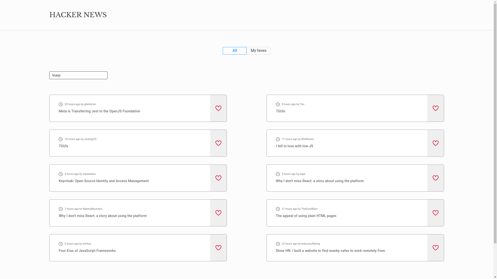
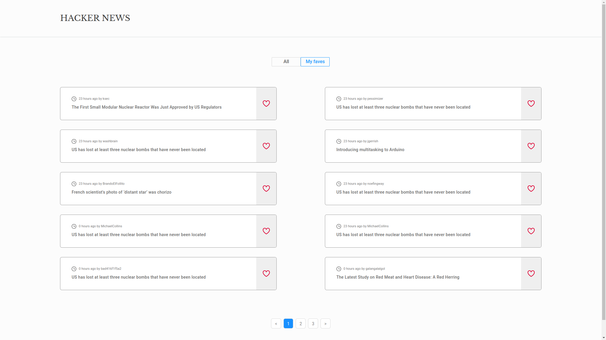

# Título del Proyecto

Frontend HackerNews-Challenge

## Description

Prueba técnica desarrollada con React v18.2.0 que consiste en maquetar un diseño proveído por la página https://zeplin.io/.
Se utilizó la API Hackers News Public. Link de la API: https://hn.algolia.com/api.
Funcionalidades:
1-El filtro seleccionado persiste en el localstorage.
2-Las publicaciones favoritas persisten en el localstorage.
3-Responsive Web Design.
4- Paginador para la pagina principal y la página de favoritos.
5- Al hacer clic sobre un post, se abre una nueva pestaña y se navega a su enlace.
6- Al hacer clic sobre el botón "Me gusta" no se activa la apertura del enlace.
7- Al pasar el cursor sobre un post, se aplica opacidad a todo el post y sus elementos secundarios.

## Getting Started

### Dependencies

- normalize.css": "^8.0.1
- react": "^18.2.0
- react-dom": "^18.2.0
- react-router-dom": "6"
- react-spinners": "^0.13.4"

### Installing

- npm install
- yarn install

### Executing program

- npm run dev
- yarn dev

## Authors

- Eduardo Daniel Viana
- Email: eduardoviana83@gmail.com
- [Github](https://github.com/eduviana)
